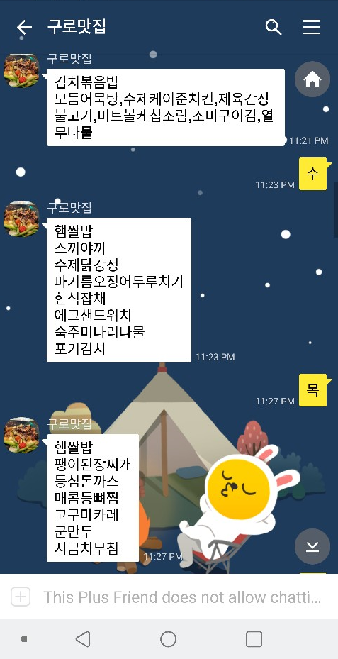

### kakaoTalk Chat bot Simple Example
- node.js 카카오 챗봇을 공부하려고 만든 간단한 예제입니다
- 근처 구내식당 메뉴를 알려줍니다( 내용은 수기로 수정. 단순한 응답기능만 있음 )
- 월,화,수,목,금 이라는 메시지를 보내면 요일에 해당하는 구내식당 메뉴를 대답합니다

### 실행방법
- install node.js
- node app.js

### 참고
- [카카오 챗봇 만드는 방법 정리](https://parkwonhui.github.io/server/2018/11/18/server-kakao-chat-bot.html)
- [홈서버를 위한 포트포워딩](https://parkwonhui.github.io/server/2018/11/18/server-port-forwarding.html)

### 실행화면

